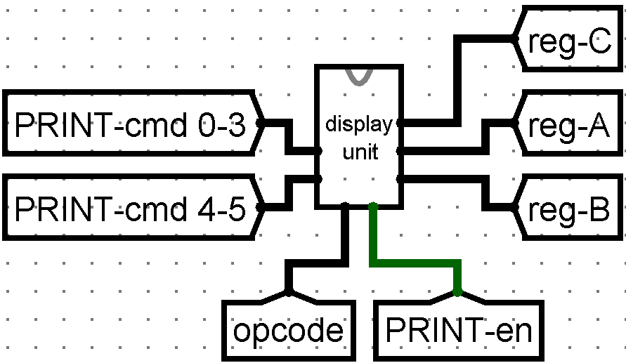

# *Computer Structure project*
# <ul><li>Student : Mahmoud Tahrawi</li><li>ID : 120200189</li>
# Components of the Processor <ul> <li>ALU</li> <li>Control Unit</li> <li>Counter Unit</li> <li>Display Unit</li> <li>Main Memory</li> <li>Instruction Memory</li> </ul>
## ALU 
#### Does the different arithmetic and logical operations<br> i.e. and, or, add, subtract, ... etc.

### <li>It takes <u>register A</u> and <u>register B</u> as operands</li>
### <li>It stores the output in <u>register C</u></li>
### <li>It takes two signals from the control unit</li>
1. <u>A / L</u> : Which tells whether the desired operation is arithmetic or logical

2. <u>ALU - en</u> : Which selects this unit

### <li>It takes a 3-bit opcode</li>

| ALU-en | A/L | opcode | result                       |
|--------|-----|--------|------------------------------|
| 1      | 0   | xxx    | Execute Arithmetic Operation |
| 1      | 1   | xxx    | Execute Logic Operation      |
| 0      | x   | xxx    | Unit not Selected            |
    Find the full version of the instructions table is attached in the project files

## Control Unit
#### It prompts the different units to work or not based on the instruction that is being executed
 
### <li>It takes a 32-bit <u>Instruction Word</u> from the Instruction Memory as input</li>
### <li>This word is constructed as follows</li>
- #### Two parameters
   1. #### <u>B</u> : b0 - b19 
   2. #### <u>A</u> : b20 - b27  
- #### <u>3-bit opcode</u> : b28 - b30
- #### 2 bits to generate signals : b31 - b32
### <li>The parameters are passed to the different units</li>
### <li>The opcode is also passed to the different units to be <br> decoded and execute a specific instruction in the selected  unit</li>
### <li>The tow most significant bits generate the signals to select the target unit</li>

| b30 - b31 | b28 - b30 (opcode) | result                    |
|-----------|--------------------|---------------------------|
|00         |000                 | halt clock (exit program)|
| 0x        | xxx                | Select ALU                |
| 10        | 0xx                | Select Display Unit       |
| 10        | 1xx                | Select Main Memory        |
| 11        | xxx                | Select Counter Unit       |
    Find the full version of the instructions table is attached in the project files

## Counter Unit
#### It manages the value of the <u>program counter register</u> and the <u>jump</u> operations

### <li>It takes one signal from the <u>Control Unit</u></li>
#### <ul><li> <u>CNTR - en</u> : which selects this unit</li></ul>

### <li>It takes two inputs (as flags)</li>
#### <ul><li> Overflow flog </li> <li> Zero flag </li> </ul>

### <li>It generates one signal based on the opcode and the input flags</li>
#### <ul><li> <u>JMP - en</u> : Which prompts the program counter to jump to a specific address in the Instruction Memory</li></ul>

| CNTR - en | opcode | executed jump instruction    | JMP - en |
|-----------|--------|------------------------------|----------|
| 1         | 000    | Jump unconditionally         | 1        |
| 1         | 001    | Jump when overflow flag is 1 | 1        |
| 1         | 010    | Jump when zero flag is 1     | 1        |
| 1         | 011    | Jump when overflow flag is 0 | 1        |
| 1         | 100    | Jump when zero flag is 0     | 1        |
| 0         | xxx    | Unit isn't selected          | 0        |
    Find the full version of the instructions table is attached in the project files

## Display Unit
#### It prompts the display segment to display a specific value

### <li>It takes one signal from the <u>Control Unit</u></li>
#### <ul><li> <u>PRINT - en</u> : Which selects this unit</li></ul>

### <li>It takes three inputs</li>
#### <u><ul><li> register A </li> <li> register B </li> <li> register C </li> </ul></u>

### <li>It generates a print command based on the opcode</li>

| PRINT-en | opcode | print command                                         |
|----------|--------|-------------------------------------------------------|
| 1        | 000    | Print value of <u>register C</U>                      |
| 1        | 001    | Print value of <u>register A</U>                      |
| 1        | 010    | Print value of <u>register B</U>                      |
| 0        | 0xx    | Unit isn't selected (dont change the displayed value) |
    Find the full version of the instructions table is attached in the project files

## Main Memory
#### It can read/write data on RAM and load data into the registers

### <li>It takes one signal from the <u>Control Unit</u></li>
#### <ul><li> <u>RAM - en</u> : which selects this unit</li></ul>

### <li>It consists of three major elements</li>
#### <u><ul> <li> RAM </li> <li> register A </li> <li> register B </li></ul></u>

### <li>It takes three inputs</li>
#### <ul> <li> <u>A</u> : Is to address the RAM  </li> <li> <u>B</u> : Is a value to be written on RAM in the specified address <u>'*A*'</u> </li> <li> <u>register C</u> : To write it's value on RAM in the specified address <u>'*A*'</u></li></ul>

### <li><u>*Register A*</u> and <u>*Register B*</u></li>
#### <ul> <li> You can load a value from a specific RAM address <u>*'A'*</u> into those two registers </li> </ul>

### <li><u>*RAM*</u></li>
#### <ul> <li>Data bit width : 19 bits</li> <li>Address bit width : 8 bits</li> <li> You can address the RAM using only parameter <u>*'A'*</u> </li> </ul>

### <li>It takes an opcode as input to select the desired memory operation</li>

| RAM - en | opcode | memory operation                                               |
|----------|--------|----------------------------------------------------------------|
 | 1        | 100    | Store in RAM address <u>*A*</u> the value <u>*B*</u>           |
| 1        | 101    | Store in RAM address <u>*A*</u> the value of <u>register C</u> |
| 1        | 110    | Load value of RAM address <u>*A*</u> into <u>register A</U>    |
| 1        | 111    | Load value of RAM address <u>*A*</u> into <u>register B</U>    |
| 0        | 1xx    | Unit isn't selected                                            |
    Find the full version of the instructions table is attached in the project files


## Instruction Memory
#### It holds the instructions to execute the desired program


### <li>It consists of two elements</li>
#### <u><ul> <li> Instruction RAM </li> <li> Program counter register </li></ul></u>

### <li><u>*Instruction RAM*</u></li>
#### <ul> <li>Data bit width : 32 bits</li> <li>Address bit width : 8 bits</li> <li> Only the program counter register can address this RAM</li> </ul>

### <li>It takes one input</li>
#### <ul> <li> <u>A</u> : The target address</li></ul>

### <li>It takes one signal from the <u>Counter Unit</u></li>
#### <ul> <li><u>JMP - en</u> : which enables the program counter to set its value to the specified address <u>'*A*'</u> </li></ul>


# How to execute a program
### 1. Write the program in assembly
    Find the full table of instructions and their assembly code attached in the project files
### 2. Use the attached assembler to decode the assembly code into binary code
```
java Assembler input.asm, output.bin
```
### 3. Copy the content of this binary file into the <u>*Instruction RAM*</u>
### 4. Start executing in <u>*Logisim*</u>

# Sample Test { Multiplication Program }
## - Assembly Code { multiple.asm }
```
store 00000000 0000000000000000000
store 00000001 0000000000000111111  store first operand here
store 00000010 0000000000000000010  store second operand here
store 00000011 0000000000000000001
lda 00000001
ldb 00000010
ldc,a
jmpz 00010100
ldc,b
jmpz 00010100
lda 00000000
ldb 00000001
addA,B
storec 00000000
lda 00000010
ldb 00000011
subA,B
storec 00000010
jmpz 00010100
jmp 00001010
lda 00000000
dispa
exit
```
##  Use the assembler
```shell
java Assembler .\multpl.asm, .\multpl.bin
```
- ## Binary Code (encoded in Hex) { multiple.bin }
```
A0000000
A008003F
A0100002
A0180001
B0080000
B8100000
8000000
D0A00000
10000000
D0A00000
B0000000
B8080000
38000000
A8000000
B0100000
B8180000
18000000
A8100000
D0A00000
C0500000
B0000000
88000000
0
```
